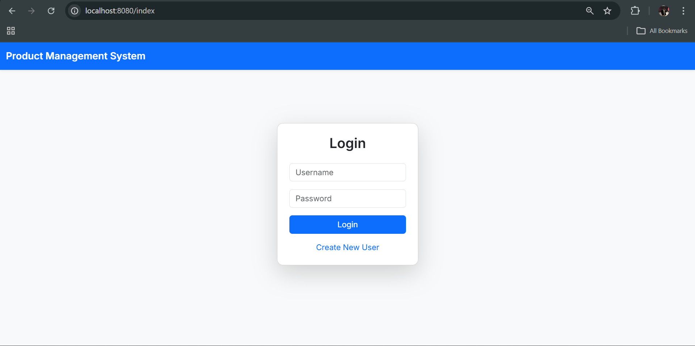
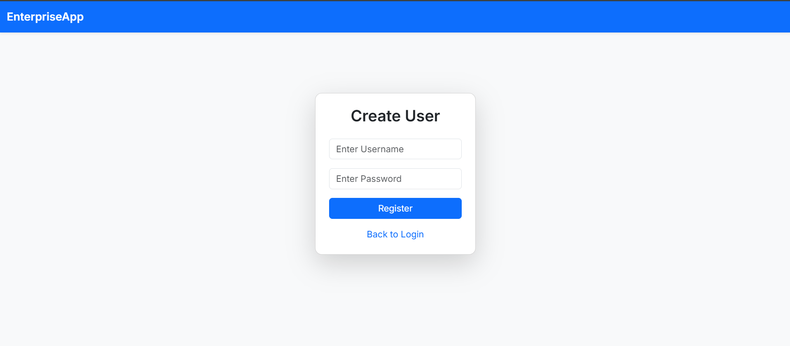
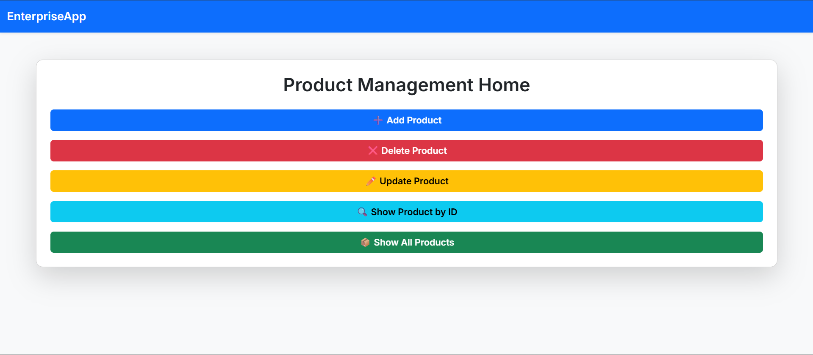
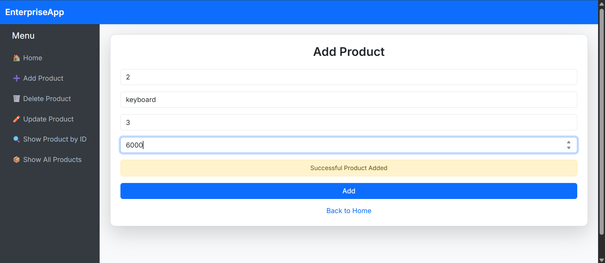
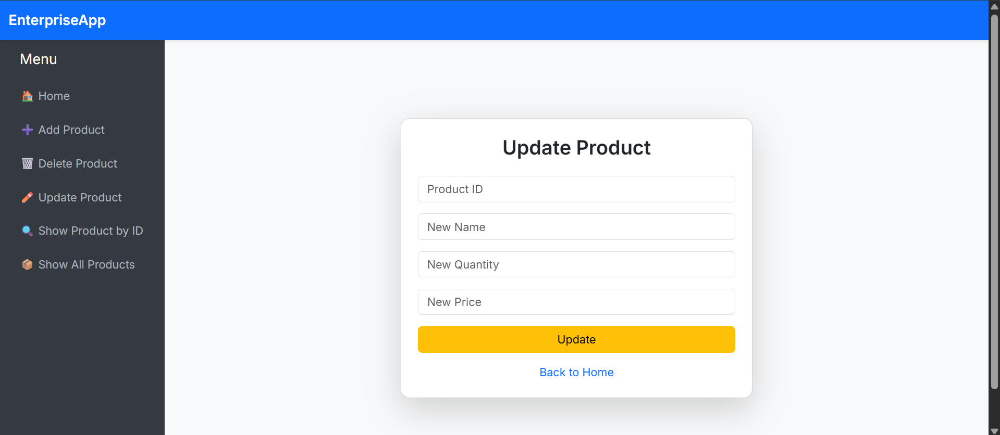
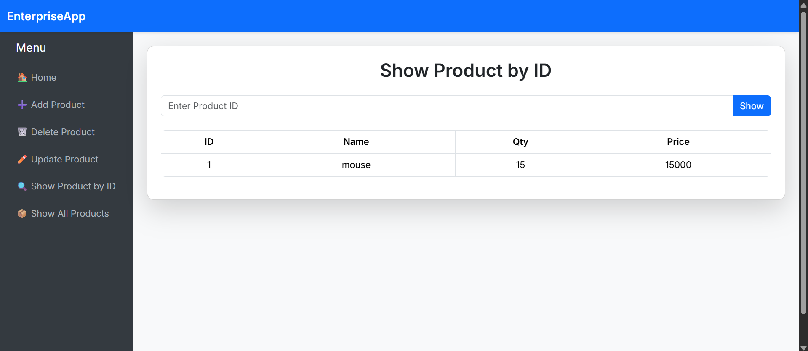
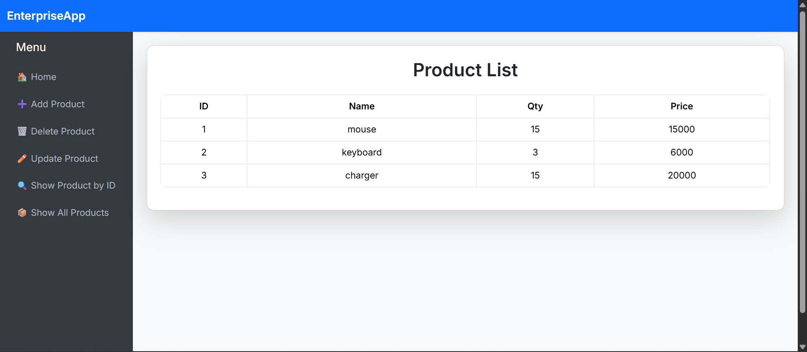

# 🛍️ Product Management Website  
### Spring Boot + Spring MVC + Spring Data JPA + H2 Database

A full-stack **Product Management Web Application** built using **Spring Boot**, **Spring MVC**, and **Spring Data JPA** with an **H2 in-memory database**.

This project demonstrates a clean **MVC architecture**, layered design, and complete **CRUD operations** for managing products.

---

## 📌 Project Overview

The application allows users to:

- ➕ Add new products  
- 📝 Update existing product details  
- ❌ Delete products  
- 🔍 View product listings  
- 📊 Manage product data using JPA  

The application follows a structured layered architecture:

```
Controller → Service → Repository → Database
```

---

## 🛠️ Tech Stack

| Layer        | Technology Used |
|--------------|-----------------|
| Backend      | Spring Boot |
| Web Layer    | Spring MVC |
| ORM          | Spring Data JPA |
| Database     | H2 In-Memory Database |
| View Layer   | JSP |
| Build Tool   | Maven |
| Language     | Java |

---

## 🏗️ Architecture (MVC Pattern)

- **Model** → Entity classes annotated with `@Entity`
- **View** → JSP pages for UI rendering
- **Controller** → Handles HTTP requests using `@Controller`
- **Service Layer** → Contains business logic
- **Repository Layer** → Extends `JpaRepository` for database operations

---

## 📂 Project Structure

```
src/main/java
│
├── controller
├── service
├── repository
├── entity
└── ProductManagementApplication.java
│
src/main/resources
│
├── application.properties
└── templates / jsp files
```

---

## 🚀 How to Run the Project

### 1️⃣ Clone the Repository

```bash
git clone https://github.com/your-username/ProductManagementWebsite_MVC-JPA-SpringBoot-JPA-h2database-.git
cd ProductManagementWebsite_MVC-JPA-SpringBoot-JPA-h2database-
```

### 2️⃣ Open in IDE

- IntelliJ IDEA  
- Eclipse  
- VS Code  

### 3️⃣ Run the Application

Run the main class:

```
ProductManagementApplication.java
```

Or use Maven:

```bash
mvn spring-boot:run
```

---

## 🌐 Application Access

After starting the application:

Main Application:
```
http://localhost:8080/
```

H2 Console:
```
http://localhost:8080/h2-console
```

### Default H2 Configuration

```
JDBC URL: jdbc:h2:mem:testdb
Username: sa
Password: (leave empty)
```

---

## ✨ Key Features

- Full CRUD functionality
- Clean layered architecture
- In-memory database for easy testing
- Lightweight and fast startup
- Production-ready project structure

---
## 📸 Screenshots

### 🔐 Login Page


### 👤 Create User Page


### 🏠 Home Page


### ➕ Add Product Page


### ❌ Delete Product Page


### ✏️ Update Product Page


### 🔍 Show Product by ID Page


### 📦 Show All Products Page


---

## 📜 License

This project is developed for learning and educational purposes.This is onGoing Project..
